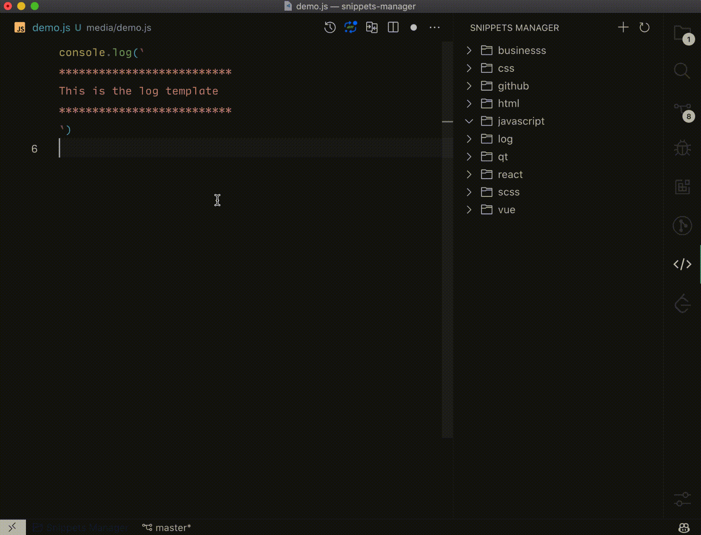
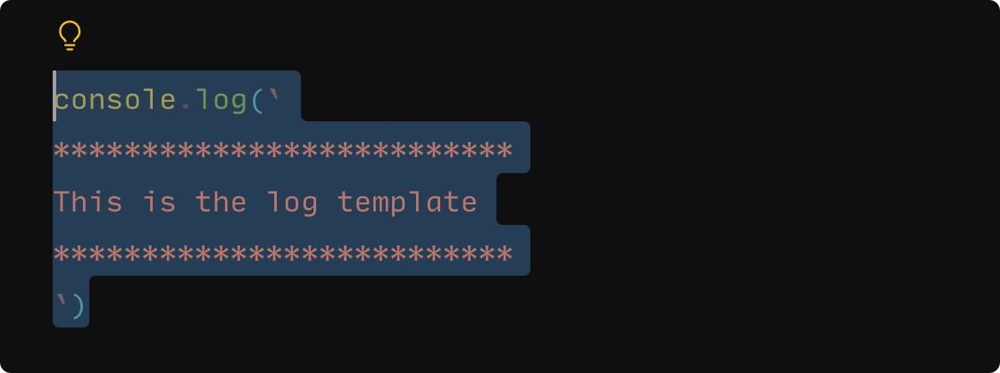
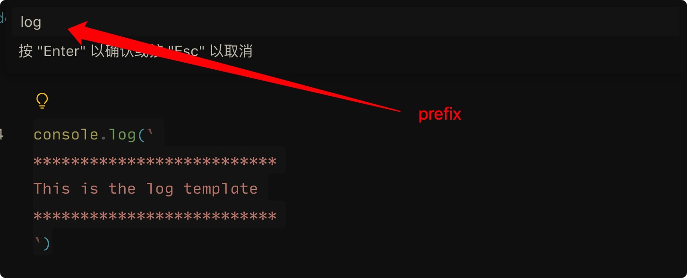
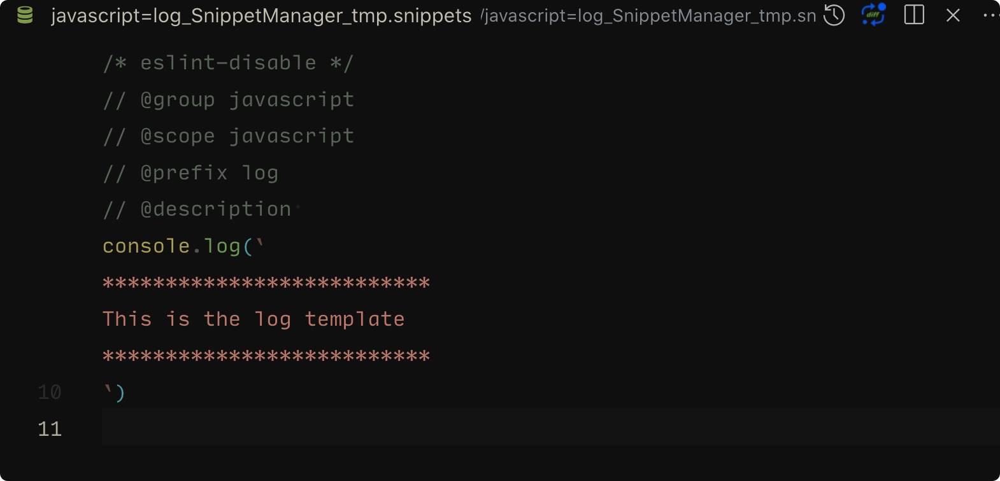
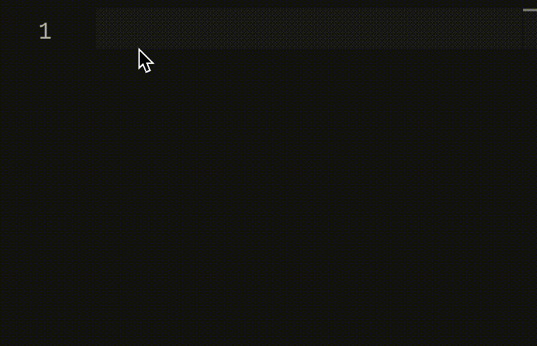

<h1>Snippets Manager</h1>

English | [简体中文](./README.zh-CN.md)
<!-- 

 

 -->

Manage your code snippets in a super easy way!

## Features

- [x] Support easily generating code snippets from selected content.
- [x] Support grouping and managing code snippets.
- [x] Automatically detect the corresponding programming language for code snippets.
- [x] Support visual management of code snippet groups through directory structure.

## How to use
1. First, select the content you want to convert into a code snippet, such as:
  
2. Press cmd+k, then press cmd+shift+s, enter the snippets shortcut and confirm.
  
3. Edit the content:
  
    - `group`: the name of the group to which the code snippet belongs, such as `project-a`.
    - `scope`: the scope of the code snippet, such as `javascript`. When left blank, the code snippet can be used in any file.
    - `prefix`: the shortcut for the code snippet, such as log for console.log template.
    - `description`: the detailed content of the code snippet prompt. To use more syntax for code snippets, please refer to the [VSCode official documentation](https://code.visualstudio.com/docs/editor/userdefinedsnippets#_snippet-syntax).
4. Finally, press `cmd+s` to save the code snippet, and you will be able to see the corresponding code snippet shortcut in the sidebar grouping. Now, we can happily use the code snippets~
  

## License
MIT
