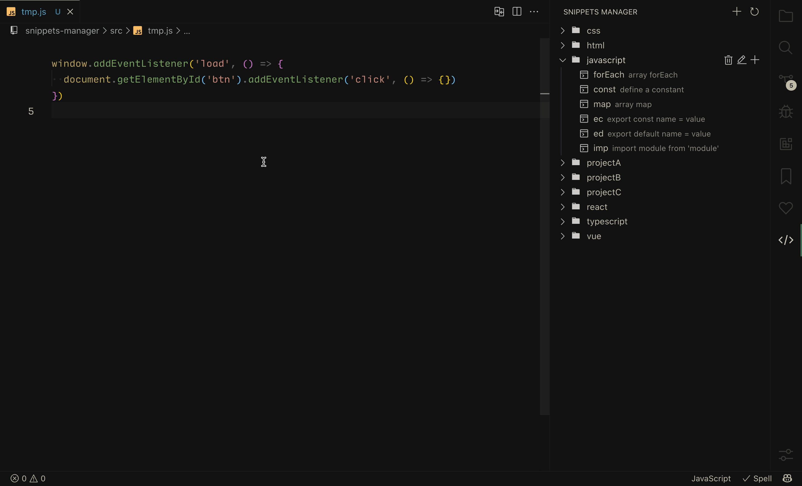

<h1>Snippets Manager</h1>

English | [简体中文](./README.zh-CN.md)
<!-- 

 

 -->

Manage your code snippets in a super easy way!

## Features

- [x] Turn you selection into a snippet easily. (default keymaps `cmd+k` `shift+cmd+s`)
- [x] Group your snippets as you like, not limited to language.
- [x] Manage code snippets visually.
- [x] Auto detect the language of snippets.

## How to use
1. Select any code you want to convert to snippet.
2. Press `cmd+k` and `shift+cmd+s`, then enter the snippets shortcut.
3. Edit the snippet content, includes the group, prefix, scope, description, and content.
4. Save this file and you will see the snippet in the snippets tree. Now you can use it!

## Future
- [ ] Suppport search snippets.
- [ ] Suppport share snippets.

## License
MIT
