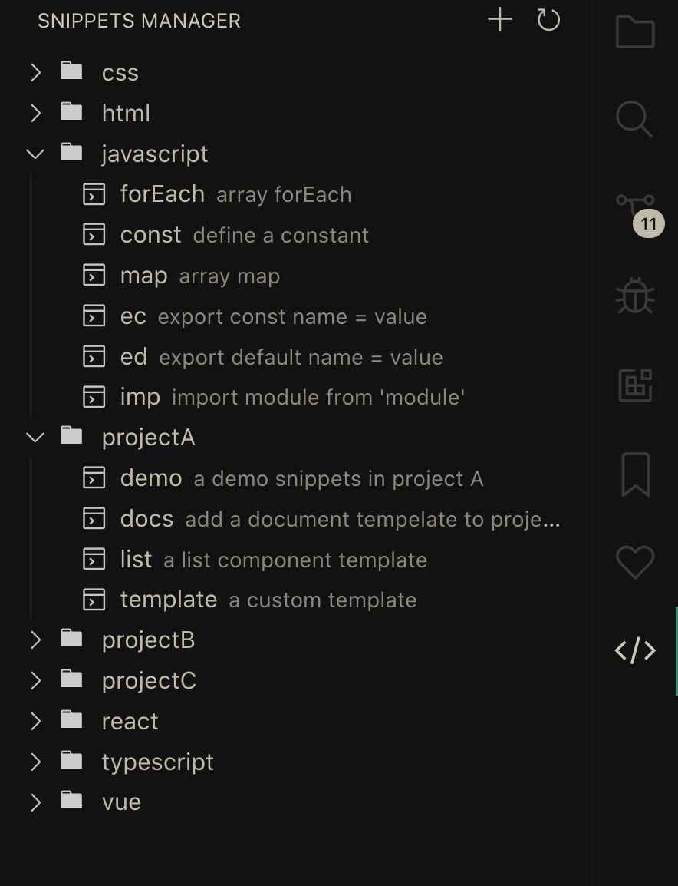

# Snippets Manager

Manage your code snippets in a super easy way!

## Features

- Turn you selection into a snippet easily. (default keymaps `cmd+k` `shift+cmd+s`)
- Group your snippets as you like, not limited to language.
- Manage code snippets visually.
- Auto detect the language of snippets.
- and etc...

## Preview

 <video id="video" loop="loop" controls="controls">
<source id="mp4" src="./media/snippets.mp4" type="video/mp4">
</video>

