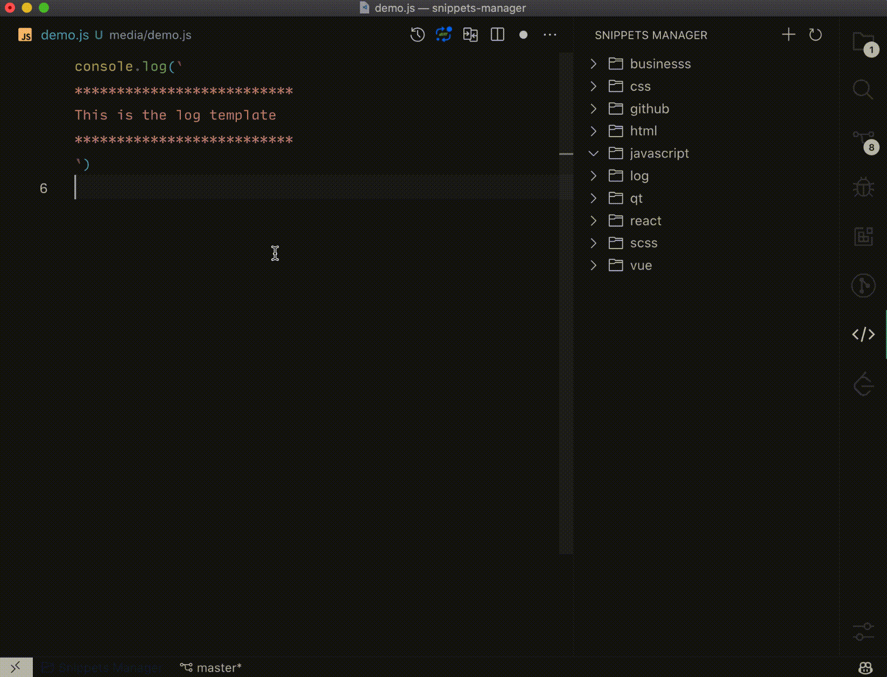
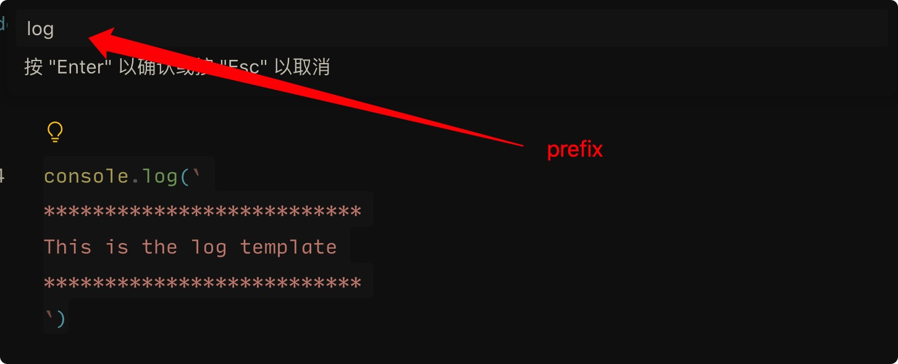
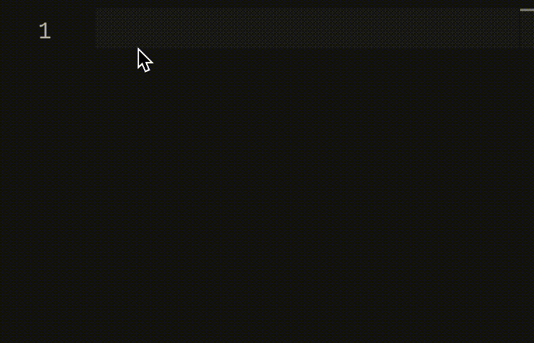

<h1>代码片段管理</h1>

[English](./README.md) | 简体中文

轻松创建和管理代码片段。

## 功能

- [x] 支持将选中内容轻松地生成代码片段。
- [x] 支持对代码片段进行分组管理。
- [x] 支持自动检测代码片段对应的编程语言。
- [x] 支持通过目录形式可视化管理代码片段分组。

## 如何使用？
1. 首先，选中你想要转换为代码片段的内容，比如：
 

2. 按下 `cmd+k`，接着按下 `cmd+shift+s`，输入代码片段的简写关键字，确认后会进入到代码片段内容编辑状态。
 
 
3. 编辑代码片段内容：
 
    - `group`：表示代码片段所属分组的名称，比如 `project-a`。
    - `scope`：表示代码片段生效范围，比如 `javascript`，不填写时表示任何文件里都可使用该代码片段。
    - `prefix`：表示代码片段的简写关键字，比如 `console.log` 对应的简写关键字为 `log`。
    - `description`：表示代码片段提示的详细内容，如果想要使用更多代码片段的语法，可以参考 [VSCode 官方文档](https://code.visualstudio.com/docs/editor/userdefinedsnippets#_snippet-syntax)。

4. 最后，按下 `cmd+s` 保存代码片段，此时就能在侧边栏分组中看到相应的代码片段关键字。现在我们就可以愉快地使用代码片段了~

## License
MIT

